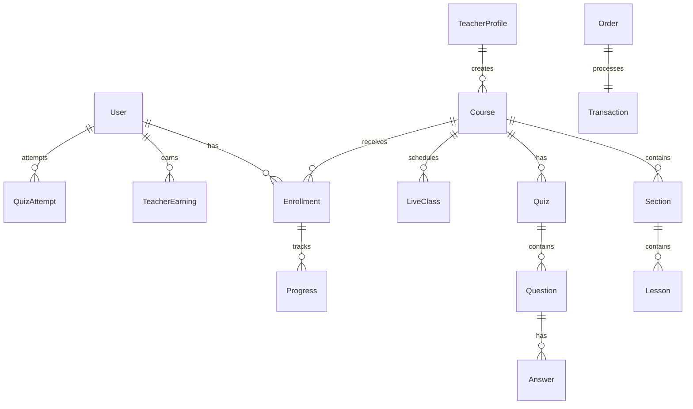

# ERD & Database Schema Specification

## Key Entities:
1. **User**: id, email, password_hash, full_name, role (STUDENT, TEACHER, ADMIN), is_approved, created_at.
2. **Category**: id, name, slug, description.
3. **Course**: id, teacher_id, category_id, title, description, price, is_published, status (DRAFT, IN_REVIEW, APPROVED), created_at.
4. **Section**: id, course_id, title, order_index.
5. **Lesson**: id, section_id, title, content_type (VIDEO, PDF, TEXT), content_url, text_content, duration_mins, is_free_preview.
6. **Enrollment**: id, student_id, course_id, enrolled_at, progress_pct.
7. **Quiz**: id, course_id, title, passing_score.
8. **Question**: id, quiz_id, prompt, question_type (MCQ, TRUE_FALSE), points.
9. **Answer**: id, question_id, text, is_correct.
10. **QuizAttempt**: id, student_id, quiz_id, score, passed, attempted_at.
11. **LiveClass**: id, course_id, teacher_id, title, scheduled_at, status, room_code.
12. **Transaction**: id, student_id, course_id, amount, teacher_share (80%), platform_share (20%), status.
13. **Embedding**: id, course_id, lesson_id, chunk_text, vector_data.
